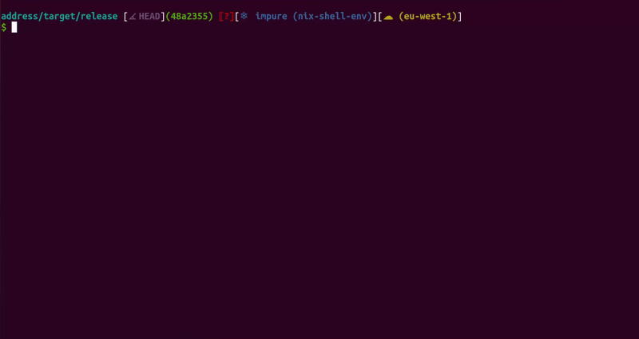

# Address Conversion CLI (Rust)



## Installation

To build and install **Address**, ensure you have **Rust** installed on your system. Then, run:

```sh
cargo build --release
```

This will generate an executable in the `target/release/` directory.

## Usage

Run the CLI with:

```sh
./address <COMMAND> [OPTIONS]
```

## Help

```sh
A CLI to convert and store postal addresses

Usage: address <COMMAND>

Commands:
  add      Save a new address
  update   Update a new address
  save     Add a Address from an existing file
  get      Retrieve an Address by Id
  list     List all saved addresses
  delete   Delete an address
  convert  Convert between address formats
  help     Print this message or the help of the given subcommand(s)

Options:
  -h, --help  Print help
```

### Commands

#### Add an Address

```sh
./address add --post-code "12345" --town-name "Paris" --country "FR" --street-name "La Vie" --name "Mademoiselle..."
```

#### Add an Address from file

```sh
./address save --file examples/individual-example2.txt --from nf
```

Use the `--enterprise` flag to distinguish between Individual and Enterprise addresses.

The `--validate` enables/disables the validation (field length for example) of the input address formats.

#### Retrieve an Address

```sh
./address get <UUID>
```

The `--format` arg allows to choose the output format. See Address Format Section

#### Update an Address

```sh
./address update <UUID> --town-name "Braga"
```

The `--format` arg allows to choose the output format. See Address Format Section

#### List All Addresses

```sh
./address list
```

#### Delete an Address

```sh
./address delete <UUID>
```

#### Convert Address Format

```sh
./address convert --file "examples/individual-example2.txt" --from nf --to iso --validate
```

Use the `--enterprise` flag to distinguish between Individual and Enterprise addresses.

The `--validate` enables/disables the validation (field length for example) of the input address formats.

### Address Formats

| argument | format         | description                                    |
| -------- | -------------- | ---------------------------------------------- |
| **json** | **JSON**       | Standard JSON representation.                  |
| **iso**  | **ISO 20022**  | XML-based international standard.              |
| **nf**   | **NF Z10-011** | French national standard for postal addresses. |

### Storage

A JSON file called `addresses.json` is used as a storage backend. All addresses are saved, updated, and retrieved from this file and if the file doesn't exist it's created.

## Running Tests

To run the tests, use the following command:

```sh
cargo test
```
